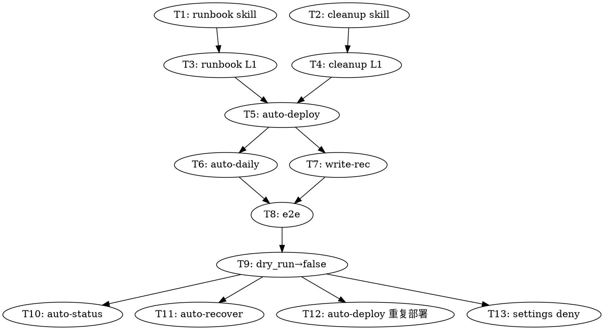

# Phase 5：部署 runbook 沉淀 + 工作区清理 — 实施计划

**Phase**：5（接 phase 1-4 编号）
**Spec**：[`../specs/2026-05-25-runbook-and-cleanup-addendum.md`](../specs/2026-05-25-runbook-and-cleanup-addendum.md)
**Date**：2026-05-25
**Status**（2026-05-26 回填）：🟡 进行中 — Task 1-4 ✅（skill 实现 + L1 测试通过，见 `../retros/2026-05-25-phase5-l1-test-retro.md`）；Task 14 🟡（v1.1+phase5 已分 3 commit：`43e453e`/`9ee6fb3`/`42bdc5c`）；Task 5-13 ⬜ pending（主流程串联 / e2e / cleanup 切 dry_run=false / 周边 skill archived 适配 / settings deny）

---

## Context

5/22 SongGen e2e 跑通后总结出两个缺口：

1. **跑通的经验没沉淀**：fixes.log + ndjson 里的修复轨迹只有这次能用，下次新 AI / 新人接手得重头再读一遍 269 min 的 trace
2. **30GB workspace 不清理**：5 个项目就把磁盘填满

phase 5 加 **runbook-agent**（写 AI 可消费的部署 runbook） + **cleanup-agent**（白名单清理可重建产物），并新增 state.json 终态 `archived`。

---

## Task 列表（按 rollout 顺序）

| # | Task | 输入 | 输出 | 验收 | 预估 | 状态 |
|---|---|---|---|---|---|---|
| 1 | 写 runbook-agent skill | spec 第 4 节 | `.claude/skills/write-deploy-runbook/{SKILL.md, _template.md}` | 文件存在，frontmatter 合法 | 1h | ✅ 本 phase 同步完成 |
| 2 | 写 cleanup-agent skill | spec 第 3 节 + R1 规则 | `.claude/skills/cleanup-deployed-workspace/SKILL.md` | 文件存在，4 道防护写齐 | 1h | ✅ 本 phase 同步完成 |
| 3 | runbook-agent L1 测试 | song-generation-run2 workspace + run3 trace | 跑一次 runbook-agent，产 `reports/runbooks/song-generation-2026-05-25.md`，含 7 节 | 7 节都有，"已知踩坑"段是 `error → fix` 二元结构 | 1h | ✅ 完成（L1 retro 2026-05-25，产出 song-generation-run2-2026-05-25.md，7 节齐全） |
| 4 | cleanup-agent dry_run L1 测试 | song-generation-run2 workspace | 跑 `dry_run=true`，输出"would rm venv (9.2GB) / .cache (6.1GB) / repo (180MB)"清单 | 清单覆盖 3 个目标，保留 state/results/logs/output；写 `cleanup.log` 含 dry_run 标记 | 30min | ✅ 完成（L1 retro + P4-5 guard test 5/5 PASS） |
| 5 | 修改 `auto-deploy/SKILL.md` | 现 SKILL.md + spec 第 1/2 节 | 在任务 4 流水线末尾追加任务 4.5（runbook dispatch）和任务 6（cleanup dispatch），cleanup 默认 `dry_run=true` | 主 agent 在 verify pass 后自动调用，不并行 | 1h | pending |
| 6 | 修改 `auto-daily/SKILL.md` | 现 SKILL.md | 同步 auto-deploy 的改造（任务 3 流水线尾部加 runbook + cleanup） | 同任务 5 | 30min | pending |
| 7 | 修改 `write-recommendation/SKILL.md` | 现 SKILL.md + spec 第 2 节 | 接收 `runbook_paths` 参数，日报"今日项目"段加 `**🔗 详细部署 runbook**` 链接 | 日报里能看到 runbook 链接 | 30min | pending |
| 8 | 整合 e2e 测试 | 一个小项目（< 5GB 权重，如 sentence-transformers/all-MiniLM-L6-v2） | 跑完整流水线（intake → verify → runbook → cleanup） | reports/runbooks/ 有文件 + workspace 只剩 state/results/logs/output | 2-4h（取决项目大小） | pending |
| 9 | cleanup 切 dry_run=false | 任务 8 验收 OK | auto-deploy/auto-daily 把 cleanup 的 `dry_run=false` 设上 | 下次部署真清磁盘 | 5min | pending |
| 10 | 修改 `auto-status/SKILL.md` | 现 SKILL.md + spec 第 3 节 | 看到 `phase=archived` 时归到"已归档（折叠）"分组 | auto-status 输出有"已归档"分组 | 30min | pending |
| 11 | 修改 `auto-recover/SKILL.md` | 现 SKILL.md | 看到 `phase=archived` 时拒绝接续，提示"用 /auto-deploy 强制覆盖" | auto-recover 不会接续 archived | 30min | pending |
| 12 | 修改 `auto-deploy` 重复部署分支 | 现 SKILL.md "重复部署同一 URL 的处理" 段 | `phase=archived` 时提示"上次已归档，重跑会重下 28GB 权重" | 用户清晰看到代价 | 15min | pending |
| 13 | 修改 `settings.json` | 现 settings + spec 第 5 节 | 加 deny 规则防 cleanup 越权 | `rm -rf workspace` 等危险命令被 deny 拦 | 15min | pending |
| 14 | 提交 git commit 系列 | 上面所有改动 | 每 task 一次 commit，message 用中文 | git log 清晰可 revert | 持续 | 🟡 部分（v1.1+phase5+测试已 3 commit：43e453e/9ee6fb3/42bdc5c；后续 Task 5-13 改动仍需 commit） |

**总预估**：8-12 小时（不含 e2e 测试等模型部署时间）

---

## 各 Task 详细规划

### Task 1: runbook-agent skill（已完成）

**文件**：
- `/root/ai-auto-harness/.claude/skills/write-deploy-runbook/SKILL.md`
- `/root/ai-auto-harness/.claude/skills/write-deploy-runbook/_template.md`

**关键设计**：
- 输入：`{slug, workspace_path, run_id, verify_passed, verify_result, github_url}`
- 抽取策略：**模板 + LLM 双层**（模板固定骨架 7 节，LLM 只填 stage 命令 / 错误速查 / AI prompt）
- 输出：`reports/runbooks/<slug>-<YYYY-MM-DD>.md` + `{runbook_path, runbook_bytes, status, stage_count, traps_documented, completed_at}`
- 失败 case 分级 status：`success / incomplete_verify_failed / paused_at_<phase> / blocked_<reason>`

### Task 2: cleanup-agent skill（已完成）

**文件**：`/root/ai-auto-harness/.claude/skills/cleanup-deployed-workspace/SKILL.md`

**关键设计**：
- 输入：`{slug, workspace_path, run_id, verify_passed, runbook_path, dry_run}`
- 4 道防护（G1-G4），任一不过 → return `{skipped: true, reason}`
- 白名单删（不用 `rm -rf $VAR/*`）：venv / .cache / repo
- 保留：state.json / results/ / logs/ / output/ / progress.md
- 落盘：`logs/cleanup.log` + `results/cleanup.json` + `state.json` 更新 `phase=archived`
- 输出：`{slug, removed, kept, freed_bytes, freed_human, dry_run, skipped, skipped_reason, completed_at}`

### Task 3: runbook-agent L1 测试

```bash
# 目标：用 song-generation-run2 现成 workspace + run3 trace，dry-run 跑 runbook-agent
cd /root/ai-auto-harness

# 模拟主 agent dispatch
SLUG="song-generation-run2"
RUN_ID="songgen-e2e-run3-resume-20260522-094040"

# 用 claude-haha 起 SubAgent
./bin/claude-haha -p "
按 write-deploy-runbook skill 跑：
- slug: $SLUG
- workspace_path: workspace/$SLUG
- run_id: $RUN_ID
- verify_passed: true
- github_url: https://github.com/tencent-ailab/SongGeneration
"
```

**期望产出**：
- `reports/runbooks/song-generation-run2-2026-05-25.md` 存在
- 7 节都齐（frontmatter / AI prompt / 前置 / 5 stage / 错误速查 / 成本 / trace 指针）
- "已知踩坑"段至少 4 条（torch sm_120 / pkg_resources.packaging / torchcodec / third_party symlink）
- 没有 HF_TOKEN / ANTHROPIC_API_KEY / 绝对路径 `/root/ai-auto-harness/` 泄露
- frontmatter `status: success`

### Task 4: cleanup-agent dry_run L1 测试

```bash
# 目标：用 song-generation-run2 现成 workspace，dry_run 跑 cleanup-agent
./bin/claude-haha -p "
按 cleanup-deployed-workspace skill 跑：
- slug: song-generation-run2
- workspace_path: /root/ai-auto-harness/workspace/song-generation-run2
- run_id: songgen-e2e-run3-resume-20260522-094040
- verify_passed: true
- runbook_path: reports/runbooks/song-generation-run2-2026-05-25.md
- dry_run: true
"
```

**期望产出**：
- `workspace/song-generation-run2/logs/cleanup.log` 新建，含 "[DRY] would rm ..."
- `workspace/song-generation-run2/results/cleanup.json` 新建，`dry_run: true`
- **state.json 不更新**（dry_run 模式）
- 磁盘不变（实际未删）
- 4 道防护全过：G1 prefix ✓ / G2 trace ✓ / G3 runbook ✓ / G4 verify_passed ✓

### Task 5: 改 auto-deploy/SKILL.md

**位置**：现有"任务 5：写报告 + 回填"前后

**改动模板**：

```diff
 ### 任务 4:走 5 阶段流水线
 ...
 # Phase 5: verify (独立判定,不读 run 的修复历史)
 if run_result.status == "done":
     Task(subagent_type="verify-agent", ...)

+### 任务 4.5: 写部署 runbook(verify pass 或 fail 都写)
+
+verify_result = read(f"workspace/{SLUG}/results/verify.json")
+runbook_result = Task(
+    subagent_type="runbook-agent",
+    description=f"write deploy runbook for {SLUG}",
+    prompt=f"""
+slug: {SLUG}
+workspace_path: workspace/{SLUG}
+run_id: {RUN_ID}
+verify_passed: {verify_result.passed}
+verify_result: {verify_result}
+github_url: {ARGUMENTS}
+
+按 write-deploy-runbook skill 跑完,return runbook_path + status。
+"""
+)
+# 写到 runs/$RUN_ID/runbook.json + 更新 state.json.runbook_path
+
 ### 任务 5:写报告 + 回填

 调 **write-recommendation** skill,同 auto-daily 任务 4。
+传入 `runbook_paths=[runbook_result.runbook_path]`,日报里加链接。
+
+### 任务 6: cleanup(verify pass 且 runbook success 时)
+
+if verify_result.passed and runbook_result.status == "success":
+    cleanup_result = Task(
+        subagent_type="cleanup-agent",
+        description=f"cleanup deployed workspace {SLUG}",
+        prompt=f"""
+slug: {SLUG}
+workspace_path: workspace/{SLUG}
+run_id: {RUN_ID}
+verify_passed: true
+runbook_path: {runbook_result.runbook_path}
+dry_run: true   # ⚠️ 首次 rollout 用 true,验证 OK 后改 false
+"""
+    )
+    # 写到 runs/$RUN_ID/cleanup.json + 更新 state.json.phase=archived
+elif verify_result.passed and runbook_result.status != "success":
+    log("⚠️ verify 过但 runbook 写失败,workspace 保留等人手处理")
+elif not verify_result.passed:
+    log("verify 未过,workspace 保留给 run-and-repair 下次接续")
```

### Task 6: 改 auto-daily/SKILL.md

同 Task 5，加在"任务 3：部署流水线"末尾、"任务 4：写报告"之前。auto-daily 用 RUN_ID 已在任务 0 生成。

### Task 7: 改 write-recommendation/SKILL.md

接收新参数 `runbook_paths: list[str]`。日报 `reports/<YYYY-MM-DD>.md` 的"今日项目"段加：

```markdown
**🔗 详细部署 runbook**：[reports/runbooks/<slug>-<date>.md](runbooks/<slug>-<date>.md)
  - 可复制给 AI 让其按此 runbook 部署
  - 含 5 stage 命令 + N 个已知踩坑修复
```

### Task 8: 整合 e2e 测试

选一个小项目（推荐 `sentence-transformers/all-MiniLM-L6-v2`，~90MB 权重，单卡跑 5 分钟）：

```bash
./bin/claude-haha -p "/auto-deploy https://github.com/sentence-transformers/sentence-transformers"
```

期望（end to end）：
- intake → fetch → install → run → verify → **runbook → cleanup** → state.json `phase=archived`
- `reports/runbooks/sentence-transformers-2026-05-25.md` 存在
- `workspace/sentence-transformers/` 只剩 state.json + results/ + logs/ + output/
- `du -sh workspace/sentence-transformers/` < 100MB

### Task 9: cleanup 切 dry_run=false

`auto-deploy/SKILL.md` 和 `auto-daily/SKILL.md` 里 cleanup 部分的 `dry_run: true` 改 `dry_run: false`。

```bash
# 一行命令切回 production 模式
sed -i 's/dry_run: true   # ⚠️ 首次 rollout/dry_run: false  # production/' \
    /root/ai-auto-harness/.claude/skills/{auto-deploy,auto-daily}/SKILL.md
```

### Task 10: 改 auto-status/SKILL.md

```diff
 # 现状: 显示所有 workspace
 find workspace -maxdepth 2 -name state.json | while read f; do
     jq -c '{slug, phase, ...}' "$f"
 done

+# 新增: 按 phase 分组
+# Group 1: 进行中 (phase ∈ {intake,fetching,installing,running,verifying})
+# Group 2: 已完成未归档 (phase = done)
+# Group 3: ★ 已归档 (phase = archived) — 默认折叠
+# Group 4: 卡住 (paused_for_human / blocked)
```

### Task 11: 改 auto-recover/SKILL.md

```diff
+# 新增: 看到 phase=archived 拒绝接续
+if [ "$PHASE" = "archived" ]; then
+    echo "❌ $SLUG 已归档（$(jq -r .archived_at $WORKSPACE/state.json)）"
+    echo "   workspace 已清理，权重已删。"
+    echo "   重跑请用: /auto-deploy $(jq -r .github_url $WORKSPACE/state.json)"
+    exit
+fi
```

### Task 12: 改 auto-deploy 重复部署分支

```diff
 if [ "$PHASE" = "done" ]; then
     # 已部署过,询问用户
     ...
+elif [ "$PHASE" = "archived" ]; then
+    echo "$SLUG 上次已归档（$(jq -r .archived_at $WORKSPACE/state.json)）"
+    echo "重跑会从 intake 开始,需重下 ~28GB 权重 + 重装环境（~60-90 min）"
+    echo "如确认: rm -rf $WORKSPACE && 再跑 /auto-deploy"
+    exit
 fi
```

### Task 13: 改 settings.json

```diff
   "deny": [
+    "Bash(rm -rf /*)",
+    "Bash(rm -rf ~/*)",
+    "Bash(rm -rf /root/*)",
+    "Bash(rm -rf workspace)",
+    "Bash(rm -rf workspace/)",
+    "Bash(rm -rf workspace/*)"
   ]
```

R1 hook 已有"跨 workspace 隔离"逻辑，但 deny 是 hard stop，做双层防御。

### Task 14: Git commit 序列

每 task 一次 commit，message 用中文（项目惯例）：

```
ai-auto: Phase 5 — Spec addendum (runbook + cleanup)
ai-auto: Phase 5 Task 1 — 加 runbook-agent skill
ai-auto: Phase 5 Task 2 — 加 cleanup-agent skill
ai-auto: Phase 5 Task 3 — runbook-agent L1 测试通过
...
ai-auto: Phase 5 Task 9 — cleanup 切到 production 模式 (dry_run=false)
ai-auto: Phase 5 完成
```

---

## 依赖关系



**关键路径**：T1+T2（并行）→ T3+T4（并行）→ T5 → T6/T7（并行）→ T8 → T9 → T10/T11/T12/T13（并行）

---

## 验收（Phase 5 完成的标志）

- [x] runbook-agent / cleanup-agent 两个 skill 文件存在 + 已注册为 project skill（/context 可见）
- [x] 在 song-generation-run2 workspace 上跑 runbook-agent 产出符合契约的 markdown（L1 测试 2026-05-25 ✅）
- [x] 在 song-generation-run2 workspace 上跑 cleanup-agent dry_run 输出正确清单（L1 + P4-5 防护 5/5 ✅）
- [ ] auto-deploy / auto-daily 末尾自动调用 runbook + cleanup（dry_run）　← Task 5-6
- [ ] 一个小项目 e2e 跑通，runbook + 清理都正确发生　← Task 8
- [ ] cleanup 切 dry_run=false，下次部署真清磁盘 ~28GB　← Task 9
- [ ] auto-status 显示 archived 项目分组　← Task 10
- [ ] auto-recover 拒绝接续 archived　← Task 11
- [ ] settings.json deny 生效（手动 `rm -rf workspace` 被拦）　← Task 13
- [ ] 全部 commit 进 git，能 revert 任一 task　← Task 5-13 改动待提交

> **进度**：前 3 项 ✅（实现 + L1 测试，commit `9ee6fb3`/`42bdc5c`）；后 7 项 ⬜ = Phase 5 主流程串联（Task 5-13）尚未做。

---

## 回滚策略

若任一 task 出问题：

| 出错的 task | 回滚方式 |
|---|---|
| T1/T2 | `rm -rf .claude/skills/{write-deploy-runbook,cleanup-deployed-workspace}` |
| T3/T4 | 测试问题，修 skill 重测 |
| T5/T6/T7 | `git revert <commit-of-this-task>` |
| T8 e2e | 看具体 fail 在哪 phase，回退对应 skill |
| T9 dry_run=false | sed 改回 true |
| T10/T11/T12 | git revert |
| T13 deny | 编辑 settings.json 删 deny 行 |

每 task 独立 commit 让回滚成本极低。

---

## 非目标（明确不做）

- 不动 5/19 原 spec
- 不实现 archive 到 tar.gz（spec YAGNI 自审已剔除）
- 不实现 cleanup 后发邮件通知
- 不实现 runbook 多语言 / 自动 PR 到 GitHub
- 不动 5 个核心 phase SubAgent（intake/fetch/install/run/verify）
- 不动 9 条 R 硬规则

---

## 参考

- Spec：[`../specs/2026-05-25-runbook-and-cleanup-addendum.md`](../specs/2026-05-25-runbook-and-cleanup-addendum.md)
- 原 spec：[`../specs/2026-05-19-ai-auto-harness-design.md`](../specs/2026-05-19-ai-auto-harness-design.md)
- 前 4 个 phase plan：
  - [`2026-05-19-phase--1-preflight-risk.md`](./2026-05-19-phase--1-preflight-risk.md)
  - [`2026-05-19-phase-0-ai-daily-scan-mcp.md`](./2026-05-19-phase-0-ai-daily-scan-mcp.md)
  - [`2026-05-19-phase-1-harness-skeleton-intake.md`](./2026-05-19-phase-1-harness-skeleton-intake.md)
  - [`2026-05-19-phase-2-fetch-install-run.md`](./2026-05-19-phase-2-fetch-install-run.md)
  - [`2026-05-19-phase-3-verify-report-human.md`](./2026-05-19-phase-3-verify-report-human.md)
  - [`2026-05-19-phase-4-docs-migration.md`](./2026-05-19-phase-4-docs-migration.md)
